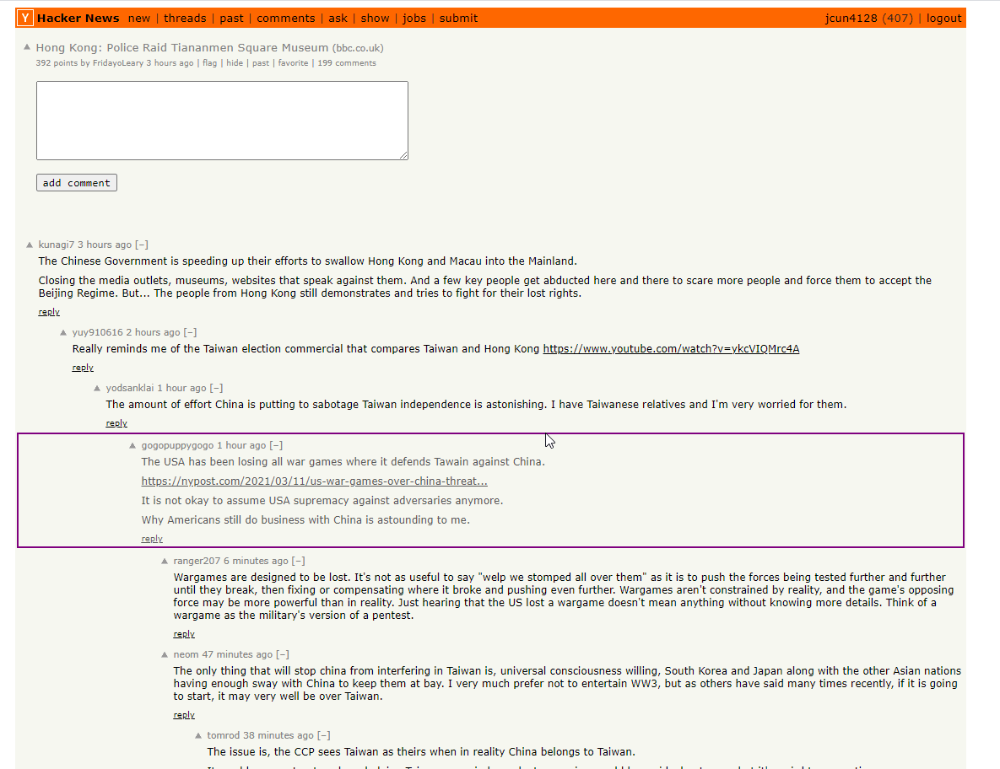

### 09/09/2021
So... I am not a NLP guy... I have some ideas about this topic just from listening to podcasts/watching some videos.
The thing I'm after is being able to look at any thread particularly something on HN maybe Reddit that I want a concensus on based on what everyone's saying.
I have a rough idea of word frequency, removing "bridge words" although they can be useful, and then some kind of tokenization... "word2vec" ha...
But I want it to be a chrome extension, so I can do it on the page on the spot.

I wanted an element target thing, at the very least can set the bounds of what to analyze.

I know the reason things are shifting around is because the borders add to the existing dimension, can fix it, but it's fine, I like the effect.

